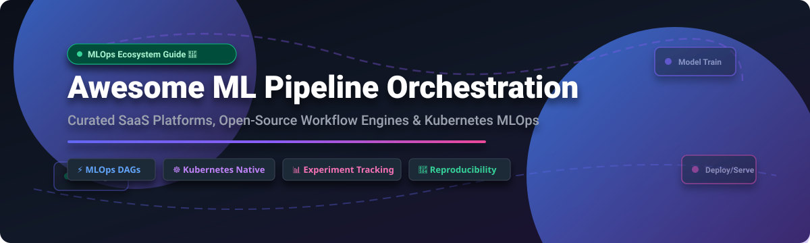

# ⚡ Awesome ML Pipeline Orchestration 🚀

    

 

 

**A curated list of top SaaS platforms, MLOps frameworks, and open-source workflow engines for building, scheduling, and scaling machine learning pipelines.**

*Focused on DAG Orchestration, Experiment Tracking, Kubernetes-Native ML, Feature Engineering, and Reproducible Model Training.*

---

## 📌 Table of Contents 🗺️

- [💡 Overview & Key Concepts](#-overview--key-concepts)
- [📊 Ecosystem Market Dynamics](#-ecosystem-market-dynamics)
- [☁️ SaaS & Managed Platforms](#️-saas--managed-platforms)
- [📦 Open-Source GitHub Projects](#-open-source-github-projects)
- [🛠️ Architecture & Integration Matrix](#️-architecture--integration-matrix)
- [🤝 How to Contribute](#-how-to-contribute)
- [❤️ Support & Community](#️-support--community-)
- [⚠️ Disclaimer](#️-disclaimer)
- [📈 Star History](#-star-history)

---

## 💡 Overview & Key Concepts 🎯

**Machine Learning Pipeline Orchestration** involves defining, executing, monitoring, and reproducing multi-step ML workflows—from data ingestion and cleaning, through model training, evaluation, experiment tracking, to automated deployment and model monitoring.

Key features provided by modern orchestrators include:
- 🔄 **DAG Execution & Caching**: Declarative dependency trees with step-level memoization.
- ☸️ **Kubernetes Integration**: Container-native execution, multi-tenant isolation, and GPU resource scheduling.
- 🧪 **Metadata & Lineage**: Tracking data artifacts, parameters, and hyperparameter run logs.
- 🌐 **Stack Portability**: Decoupling pipeline code from the underlying execution infrastructure (local, K8s, Cloud).

---

## 📊 Ecosystem Market Dynamics 📈

The global **MLOps and ML Pipeline Orchestration market** is estimated at **$3.5 Billion in 2024** and is projected to reach over **$18.5 Billion by 2030** (CAGR of ~32%). 

The market structure is **moderately fragmented**:
- **Hyperscaler Cloud Services** (AWS SageMaker Pipelines, GCP Vertex AI Pipelines) dominate enterprise suites where data already resides.
- **Venture-backed Commercial SaaS Platforms** (Astronomer, Prefect Cloud, Dagster+, Outerbounds, Union.ai, ClearML) provide specialized developer ergonomics, asset lineage, and zero-ops hosting.
- **Open-Source Foundations** remain the primary runtime layer. A "winner-take-all" consolidation has not occurred; instead, engineering teams frequently combine open-source frameworks (Flyte, Metaflow, ZenML, Kubeflow) with custom enterprise integrations.

---

## ☁️ SaaS & Managed Platforms 🌐

*Sorted by Estimated Company Size / Valuation / Funding (Descending).*

| Platform 🚀 | Company Size / Valuation 🏢 | Pricing (Starting Tier) 💰 | Free Tier / Trial Limits 🎁 | Key MLOps Features ⚙️ |
| :--- | :--- | :--- | :--- | :--- |
| **[Google Cloud Vertex AI Pipelines](https://cloud.google.com/vertex-ai/docs/pipelines/introduction)** | ~$2.10 Trillion Market Cap (Alphabet) | $0.03 per pipeline run execution + $0.045/vCPU-hr compute | $300 free credits valid for 90 days across GCP resources | Serverless KFP/TFX execution, integrated model registry & artifact lineage |
| **[AWS SageMaker Pipelines](https://aws.amazon.com/sagemaker/pipelines/)** | ~$1.95 Trillion Market Cap (Amazon) | $0.05 per pipeline execution + $0.05/ml.m5.large-hr compute | 2-month free trial with 250 hours of pipeline step execution | MLOps CI/CD templates, model registry & automated lineage tracking |
| **[Astronomer (Managed Airflow)](https://www.astronomer.io/)** | ~$1.00 Billion Valuation ($283M Raised) | $0.35 per Astronomer Compute Unit (ACU) hr ($150/mo base) | 14-day free trial with $300 compute credits included | Managed Apache Airflow DAGs, auto-scaling & enterprise governance |
| **[Prefect Cloud](https://www.prefect.io/pricing)** | ~$200 Million Valuation ($32M Raised) | $29/user/month (Pro tier) or $0.0001 per flow run | Free Forever plan: 1 user, 1,000 workspace actions/mo & 3 concurrent runs | Dynamic execution, real-time observability & automated event triggers |
| **[Dagster+ (Dagster Cloud)](https://dagster.io/pricing)** | ~$180 Million Valuation ($41.5M Raised) | $10/user/month + $0.01/compute min ($100/mo Team plan) | Free Forever tier: 1 project, 2,500 credits/mo & 1 user account | Software-Defined Assets (SDAs), data lineage & preview environments |
| **[ClearML Hosted](https://clear.ml/pricing/)** | ~$80 Million Valuation ($13M Raised) | $15/user/month billed annually ($18/mo monthly) | Free Forever plan: up to 3 users, 100GB storage & experiment tracking | All-in-one suite: experiment tracking, pipeline orchestration & GPU queues |
| **[Outerbounds (Managed Metaflow)](https://outerbounds.com/)** | ~$70 Million Valuation ($16M Raised) | Starter cloud deployment at $500/month per workspace | 14-day sandbox trial with pre-provisioned cloud compute & GPU instances | Human-centric Python workflows, full stack isolation & AWS/GCP integrations |
| **[Union.ai (Managed Flyte)](https://www.union.ai/)** | ~$70 Million Valuation ($19.1M Raised) | $0.10/vCPU-hr + $0.01/GB-RAM-hr (Union Serverless) | 14-day free trial with $200 compute credits & full feature access | Type-safe deterministic pipelines, intra-task caching & multi-tenant K8s |
| **[Iguazio (Managed MLRun)](https://www.mlrun.org/)** | ~$50 Million Acquisition (by McKinsey) | Commercial enterprise cluster license starting at $2,000/month | 14-day enterprise trial on AWS/GCP with full feature access | Real-time feature store, automated serverless functions & model monitoring |
| **[ZenML Cloud](https://www.zenml.io/pricing)** | ~$30 Million Valuation ($6.4M Raised) | Pro Team plan starting at $49/month per organization | Free Forever Developer plan: 1 user & 1 active pipeline stack connection | Framework-agnostic stack abstractions, portable pipelines & artifact tracking |

---

## 📦 Open-Source GitHub Projects 🛠️

*Sorted by GitHub Star Count (Descending).*

| Project 📦 | GitHub Stars ⭐ | Repository Link 🔗 | Description / Primary Use Case 💡 |
| :--- | :--- | :--- | :--- |
| **Apache Airflow** |  | [`apache/airflow`](https://github.com/apache/airflow) | Industry-standard programmatic workflow orchestration platform to author, schedule, and monitor Python DAGs. |
| **Ray** |  | [`ray-project/ray`](https://github.com/ray-project/ray) | Unified compute framework for scaling AI and Python workloads, including Ray Workflows & Ray Train. |
| **MLflow** |  | [`mlflow/mlflow`](https://github.com/mlflow/mlflow) | Open-source platform for managing the ML lifecycle including experiment tracking, models & MLflow Pipelines. |
| **Prefect** |  | [`PrefectHQ/prefect`](https://github.com/PrefectHQ/prefect) | Python-native workflow engine with dynamic DAG execution, async support, task retries, and hybrid execution. |
| **Argo Workflows** |  | [`argoproj/argo-workflows`](https://github.com/argoproj/argo-workflows) | Container-native, Kubernetes-first workflow engine for parallel step orchestration and compute intensive ML jobs. |
| **Kubeflow** |  | [`kubeflow/kubeflow`](https://github.com/kubeflow/kubeflow) | Cloud-native MLOps toolkit featuring Kubeflow Pipelines (KFP), Katib hyperparameter tuning, and training operators. |
| **DVC (Data Version Control)** |  | [`iterative/dvc`](https://github.com/iterative/dvc) | Git-based data and model versioning tool with lightweight pipeline DAG definitions and dataset tracking. |
| **Dagster** |  | [`dagster-io/dagster`](https://github.com/dagster-io/dagster) | Asset-oriented orchestrator for data & ML engineering, providing lineage tracking, testing, and asset catalogs. |
| **Metaflow** |  | [`Netflix/metaflow`](https://github.com/Netflix/metaflow) | Python framework developed at Netflix for human-friendly data science, distributed compute, and automatic state handling. |
| **ClearML** |  | [`allegroai/clearml`](https://github.com/allegroai/clearml) | Open-source MLOps suite for experiment tracking, pipeline building, remote execution queues, and model registries. |
| **Flyte** |  | [`flyteorg/flyte`](https://github.com/flyteorg/flyte) | Strictly-typed, Kubernetes-native workflow engine built at Lyft for reproducible, production-grade ML & data pipelines. |
| **Kedro** |  | [`kedro-org/kedro`](https://github.com/kedro-org/kedro) | Modular Python framework for creating reproducible, maintainable data science and machine learning code pipelines. |
| **ZenML** |  | [`zenml-io/zenml`](https://github.com/zenml-io/zenml) | Extensible MLOps framework for writing portable pipelines that deploy seamlessly across Airflow, Kubeflow, or local runners. |
| **Orchest** |  | [`orchest/orchest`](https://github.com/orchest/orchest) | Visual pipeline builder for data science that executes Jupyter notebook and script steps inside isolated containers. |
| **MLRun** |  | [`mlrun/mlrun`](https://github.com/mlrun/mlrun) | Open-source MLOps orchestration framework for automating data processing, model training, feature stores & real-time serving. |
| **Snakemake** |  | [`snakemake/snakemake`](https://github.com/snakemake/snakemake) | Python-based workflow management system creating reproducible and scalable data analysis and ML execution pipelines. |

---

## 🛠️ Architecture & Integration Matrix 🧩

When evaluating ML orchestrators, teams typically choose based on three core architectural paradigms:

1. **Kubernetes-Native (Flyte, Kubeflow, Argo Workflows)**: Best suited for enterprise platform engineering teams operating dedicated GPU Kubernetes clusters with containerized step isolation.
2. **Asset-Centric & Dynamic Python (Dagster, Prefect, Metaflow)**: Ideal for rapid data science iteration, code-first DAG generation, and software-defined asset lineage.
3. **Meta-Orchestration Layers (ZenML, Kedro, MLRun)**: Provides an abstraction layer separating pipeline code from execution backends (switch between local, Airflow, and Kubeflow via configuration).

---

## 🤝 How to Contribute ✍️

Contributions are very welcome! To add a new platform or update existing pricing/features:

1. 🍴 **Fork** the repository.
2. 📝 **Edit** [`README.md`](file:///C:/Users/ishan/Documents/Projects/Awesome-ML-Pipeline-Orchestration/README.md) keeping the exact markdown table format, sorting rules, and star badge links.
3. 🔍 Ensure descriptions remain factual, concise, and linked to official project sources.
4. 🚀 **Submit** a Pull Request with a clear summary of changes.

---

## ❤️ Support & Community 🌟

Thank you for exploring this curated guide to ML Pipeline Orchestration platforms! If this repository helped you evaluate tools or build your MLOps pipeline architecture, please consider supporting the project:

- ⭐️ **Star** this repository to help others discover it on GitHub.
- 🍴 **Fork** it to maintain your own reference copy or contribute new entries.
- 📢 **Share** it with your machine learning engineering, data science, and platform teams.
- ☕ **Sponsor / Buy Me a Coffee**: Support ongoing research and maintenance via the [GitHub Sponsor Dashboard](https://github.com/sponsors/ishandutta2007).

---

## ⚠️ Disclaimer 📜

- This list is **community-curated** for informational and educational purposes.
- Product valuations, pricing models, and star counts are updated periodically but may change over time.
- Machine learning pipelines handle sensitive training data and production artifacts. Proper enterprise access controls, data encryption, and reproducibility audits should be conducted prior to production deployment.

---

## 📈 Star History ⭐

---

**Maintained with ❤️ for the global MLOps and Machine Learning community.**

